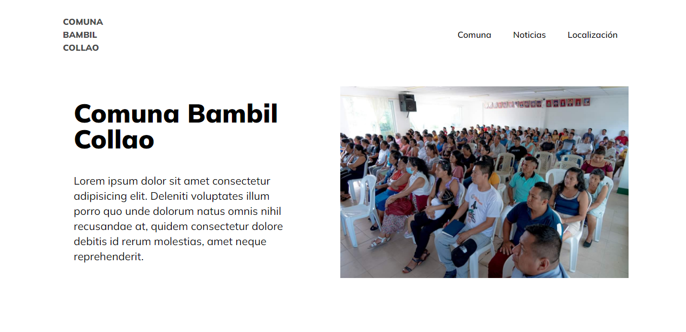

<!---->
<div align="center">

</div>

# 🏘️ Comuna Bambil Collao - Asistente Personal y Noticias

<p>Este proyecto es una modificación del proyecto original desarrollado por: <strong>Thiago Silva Lopes</strong>, en 09/2022, para el code challenge de la vaga de Front End Jr de Scaleup.</p>

<p>Añadimos un asistente personal para responder a tus preguntas frecuentes y mantenerte informado con las últimas noticias de la Comuna Bambil Collao.</p>

### Asistente Personal

Nuestro asistente personal está aquí para ayudarte con todas tus dudas y consultas sobre la Comuna Bambil Collao. No dudes en hacer preguntas y obtener respuestas instantáneas.

### Noticias

Mantente al tanto de las últimas noticias y eventos en la Comuna Bambil Collao. Aquí encontrarás actualizaciones sobre eventos comunitarios, proyectos en curso y mucho más.

## Demo

Puedes ver una demostración en vivo de nuestro proyecto en [Demo: Comuna Bambil Collao](https://tu-enlace-demo-aqui.com).

## Instrucciones para Ejecutar el Proyecto Localmente

Si deseas ejecutar este proyecto en tu propio entorno local, sigue estos pasos:

1. Clona el repositorio:

   ```bash
   git clone https://github.com/StevenRosalesC/landing-page.git
   cd landing-page

2. Instala las dependencias:


   yarn install

3. Compila y ejecuta el proyecto:


   yarn dev

## Contacto Steven Rosales

- **Steven Rosales**
  - GitHub: [Tu GitHub](https://github.com/StevenRosalesC)
  - Correo electrónico: stevenrosales31@gmail.com
## Contacto Thiago Silva Lopes

- **Thiago Silva Lopes**
  - GitHub: [Tu GitHub](https://github.com/TuUsuarioGitHub)

<small>
<a href="https://github.com/Thiagoow" target="_blank">
  © Thiago Silva Lopes
</a>
</small>
